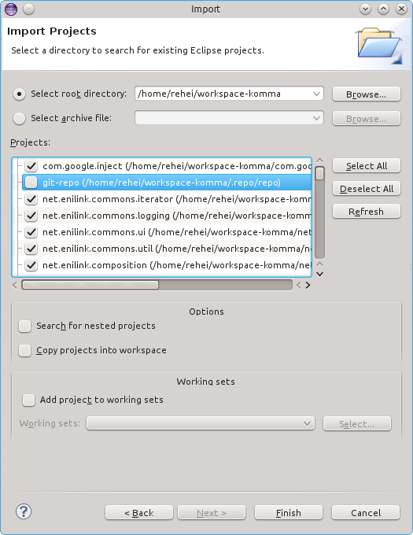
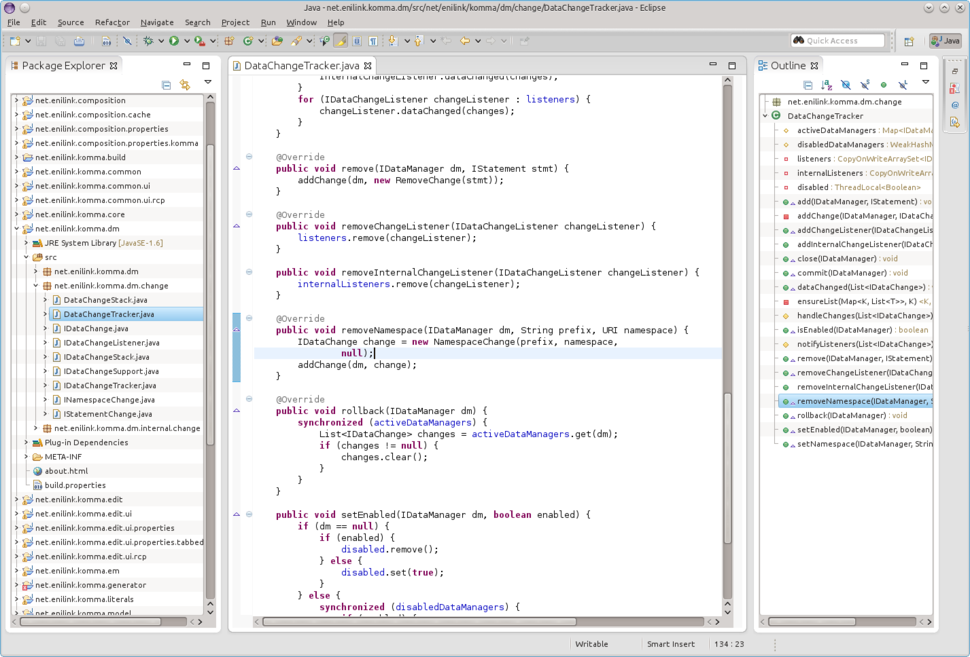

= Get the sources

The source code of eniLINK is hosted on Github at https://github.com/enilink/enilink.

The easiest way to get the source code is:

[source,text]
----
git clone --recursive https://github.com/enilink/enilink
----

NOTE: The `--recursive` option is required to fetch the git submodules that are contained within the KOMMA repository.

= Use Maven to build eniLINK

eniLINK can be built with Maven by leveraging https://eclipse.org/tycho/[Eclipse Tycho]. You can simply use `mvn package` to compile and package all modules or `mvn install` to install them within your local Maven repository.

If you like to build an update site (or rather an Eclipse P2 repository) for eniLINK then use

[source,text]
----
cd releng/platform-updatesite
mvn package
----

to create it. Afterwards an archive file with the contents can be found within the `target-maven` subdirectory.
The uncompressed P2 repository can be found at `features/net.enilink.platform.updatesite/target-maven/repository`.

= Use Eclipse to develop eniLINK
For working with the sources we suggest you to download a clean installation of 
Eclipse. Then import all repositories into your workspace by clicking 
__File > Import > Existing Projects into Workspace__

You are ready to go :)

